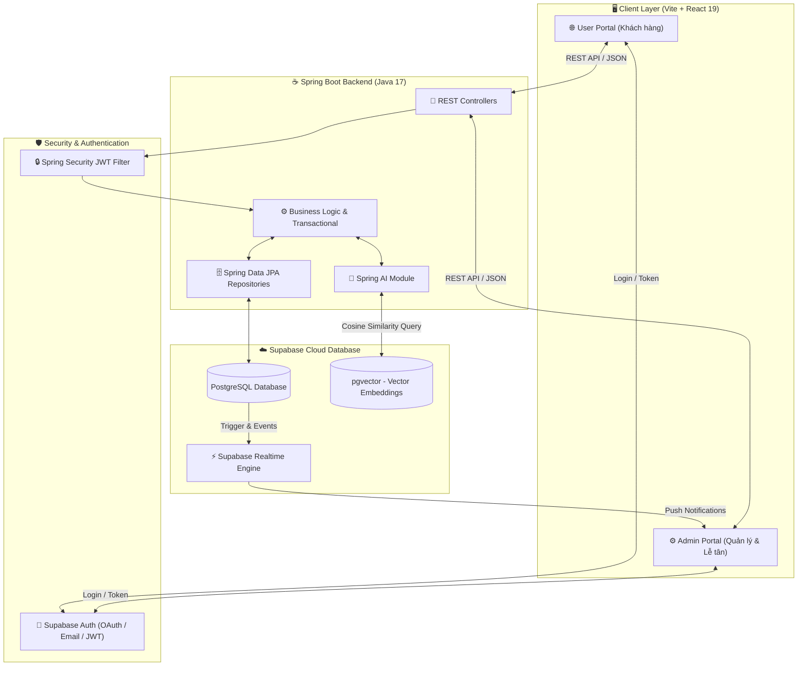

# 🏨 Smart Hotel Booking - Hệ thống Đặt phòng Khách sạn Thông minh Tích hợp AI

[](https://www.oracle.com/java/technologies/javase/jdk17-archive-downloads.html)
[](https://spring.io/projects/spring-boot)
[](https://spring.io/projects/spring-ai)
[](https://react.dev/)
[](https://vitejs.dev/)
[](https://supabase.com/)
[](https://jwt.io/)

> **Smart Hotel Booking** là giải pháp phần mềm quản lý và đặt phòng khách sạn toàn diện (Full-stack), được kiến trúc theo tiêu chuẩn công nghiệp hiện đại. Dự án nổi bật với sự kết hợp sâu sắc giữa **Backend Spring Boot** vững chắc, **Cơ sở dữ liệu đám mây Supabase (PostgreSQL + pgvector)** và **Giao diện React 19** mượt mà, đồng thời tích hợp các tính năng **Trí tuệ nhân tạo (AI Virtual Concierge & Smart Semantic Search)** mang lại trải nghiệm đột phá cho người dùng.

---

## 🌟 Điểm nhấn Kỹ thuật dành cho Nhà tuyển dụng (Engineering Highlights)

Dự án được xây dựng không chỉ để đáp ứng các yêu cầu nghiệp vụ đặt phòng thông thường, mà còn tuân thủ nghiêm ngặt các thực hành tốt nhất trong kỹ thuật phần mềm (**Software Engineering Best Practices**):

### 1. Kiến trúc Backend chuẩn Clean Code & Layered Architecture
*   **Phân tách trách nhiệm rõ ràng**: `Controller` (Tiếp nhận & Validate request) ➔ `Service` (Xử lý nghiệp vụ & Transaction) ➔ `Repository` (Giao tiếp CSDL qua Spring Data JPA) ➔ `DTO / Model` (Chuyển đổi dữ liệu, bảo mật cấu trúc Entity).
*   **Xử lý Ngoại lệ Tập trung (Global Exception Handling)**: Sử dụng `@RestControllerAdvice` và `@ExceptionHandler` để bắt toàn bộ lỗi hệ thống, chuẩn hóa JSON response trả về cho Client.
*   **Custom Validation**: Tự xây dựng các Annotation kiểm thực phức tạp (ví dụ: kiểm tra ngày check-in phải trước check-out và nằm trong tương lai).
*   **Bảo mật Phi trạng thái (Stateless Security)**: Cấu hình `Spring Security` ở chế độ `STATELESS`, tích hợp Custom Filter xác thực chữ ký và Custom Claims của **Supabase JWT**.

### 2. Trí tuệ Nhân tạo & Cơ sở dữ liệu Vector (AI & Modern Database Engineering)
*   **Smart Semantic Search (pgvector)**: Sử dụng mô hình Vector Embedding để biểu diễn ngữ nghĩa của phòng khách sạn. Truy vấn tương đồng cô-sin (**Cosine Similarity**) trực tiếp trên PostgreSQL giúp tìm kiếm phòng theo ngôn ngữ tự nhiên với độ chính xác cao.
*   **AI Virtual Concierge (NLP & Intent Recognition)**: Chatbot thông minh nhận diện ý định (Intent) và tham số (Parameters) từ câu nói của khách hàng để:
    *   Tự động gợi ý phòng và cung cấp liên kết đặt phòng trực tiếp.
    *   Tiếp nhận yêu cầu dịch vụ phòng (Housekeeping) và đồng bộ thời gian thực đến nhân viên buồng phòng.
*   **Ngăn chặn Đặt trùng phòng (Double Booking Prevention ở tầng DB)**: Sử dụng kiểu dữ liệu `tsrange` kết hợp ràng buộc `EXCLUDE USING gist` của PostgreSQL, đảm bảo tính toàn vẹn dữ liệu ngay ở tầng cơ sở dữ liệu khi có nhiều giao dịch đồng thời.

---

## 🏗️ Kiến trúc Hệ thống & Luồng dữ liệu (System Architecture)



---

## 🚀 Các Tính năng Trọng tâm

### 🤖 1. AI Virtual Concierge (Trợ lý ảo Lễ tân & Buồng phòng)
*   **Hỏi đáp nội quy (Q&A)**: Trả lời tự động, chính xác các quy định về giờ nhận/trả phòng, chính sách thú cưng, giờ mở cửa các tiện ích (Hồ bơi, Gym, Spa).
*   **Hỗ trợ tìm & đặt phòng qua hội thoại**: Khách hàng chỉ cần gõ: *"Tôi muốn tìm phòng Suite có bồn tắm cho 2 người vào cuối tuần này"*, AI sẽ phân tích các tham số (Loại phòng, Tiện ích, Số người, Thời gian) và trả về danh sách phòng kèm nút đặt ngay trong khung chat.
*   **Tích hợp Housekeeping thời gian thực**: Khách lưu trú gửi yêu cầu qua chat (ví dụ: *"Cho tôi xin thêm 2 khăn tắm lên phòng 101"*). Hệ thống tự động phân tích ý định, tạo phiếu yêu cầu dịch vụ và thông báo **Realtime** qua app của nhân viên buồng phòng.

### 🔍 2. Smart Semantic Search (Tìm kiếm Ngữ nghĩa Thông minh)
*   Khác biệt hoàn toàn với tìm kiếm từ khóa truyền thống (Keyword Search), tính năng Tìm kiếm Ngữ nghĩa cho phép khách hàng mô tả trải nghiệm mong muốn: *"Phòng yên tĩnh để làm việc, có ban công hướng biển và ánh sáng tự nhiên"*.
*   Hệ thống biến đổi câu truy vấn thành Vector Embedding và thực hiện tính toán khoảng cách cô-sin trên bảng `room_types` của Supabase, mang đến kết quả gợi ý cá nhân hóa và sát với nhu cầu nhất.

### 🏨 3. Quản lý Đặt phòng & Vận hành Khách sạn (Core Booking Engine)
*   **Quy trình đặt phòng mượt mà**: Lọc phòng trống theo ngày Check-in/Check-out, số người lớn, trẻ em. Tính toán giá tiền tự động.
*   **Quản lý Vòng đời Đơn hàng (Booking Lifecycle)**: Cập nhật trạng thái `PENDING` (Chờ thanh toán), `CONFIRMED` (Đã xác nhận), `CANCELLED` (Đã hủy), `COMPLETED` (Hoàn thành).
*   **Quản lý Phòng vật lý & Loại phòng**: Phân quyền cho Admin thêm/sửa/xóa các loại phòng, thiết lập cấu hình giường, giá cơ bản, diện tích và tiện ích đi kèm.

### 💳 4. Tích hợp Thanh toán & Quản lý Tài khoản
*   **Cổng thanh toán**: Hỗ trợ tích hợp thanh toán trực tuyến và ghi nhận lịch sử giao dịch rõ ràng.
*   **Hồ sơ người dùng & Hạng thành viên**: Tự động tạo hồ sơ khách hàng thông qua Database Trigger khi đăng ký. Quản lý tích điểm và hạng thành viên (Loyalty Tiers: Member, Silver, Gold, Diamond).

---

## 📁 Cấu trúc Thư mục Dự án

```text
Smart-Hotel-Booking/
├── backend/                  # ☕ Spring Boot Backend (Java 17)
│   ├── src/main/java/com/hotel/booking/
│   │   ├── config/           # Cấu hình Spring Security, CORS, Supabase, Spring AI
│   │   ├── controller/       # REST Controllers (Booking, RoomType, Admin, Payment, Auth)
│   │   ├── dto/              # Data Transfer Objects (Request/Response payloads)
│   │   ├── exception/        # Global Exception Handler & Custom Exceptions
│   │   ├── model/            # JPA Entities (Hotel, RoomType, Room, Booking, Profile...)
│   │   ├── repository/       # Spring Data JPA Repositories & Custom Native Queries
│   │   └── service/          # Business Logic Layer (BookingService, AdminService...)
│   └── pom.xml               # Quản lý phụ thuộc Maven
│
├── frontend/                 # 🌐 User Portal (React 19 + Vite)
│   ├── src/
│   │   ├── components/       # Reusable UI Components (Navbar, BookingModal...)
│   │   ├── pages/            # LandingPage, SearchPage, DashboardPage, Login/Register
│   │   └── supabaseClient.js # Cấu hình kết nối Supabase SDK
│   └── package.json
│
├── frontend-admin/           # ⚙️ Admin & Staff Portal (React 19 + Vite)
│   ├── src/
│   │   └── pages/            # AdminPage (Quản lý phòng, đơn đặt phòng, Housekeeping Realtime)
│   └── package.json
│
├── database/                 # 🗄️ Database Scripts & Migrations
│   └── init.sql              # Script khởi tạo DDL, Triggers, RLS Policies & Seed Data
│
└── docs/                     # 📚 Tài liệu Kiến trúc & Hướng dẫn Thực hành (Skills)
    ├── spring-boot-architecture.md
    └── skills/
        ├── spring-boot-core-best-practices.md # Chi tiết về Core & Security Best Practices
        ├── spring-ai-supabase-vector.md       # Chi tiết về pgvector & Semantic Search
        └── ai-chat-intent-recognition.md      # Chi tiết về AI Virtual Concierge
```

---

## 🛠️ Hướng dẫn Cài đặt & Khởi chạy (Getting Started)

### Yêu cầu hệ thống (Prerequisites)
*   **Java Development Kit (JDK)**: Phiên bản 17 hoặc cao hơn.
*   **Node.js**: Phiên bản 18+ và `npm`.
*   **Apache Maven**: Phiên bản 3.8+.
*   **Tài khoản Supabase**: Để lưu trữ CSDL PostgreSQL và cấu hình Authentication.

---

### Bước 1: Khởi tạo Cơ sở dữ liệu (Supabase Setup)
1.  Đăng nhập vào [Supabase Console](https://supabase.com/) và tạo một Project mới.
2.  Mở tab **SQL Editor** trong Supabase.
3.  Copy toàn bộ nội dung trong file [`database/init.sql`](database/init.sql) và chạy script.
    *   *Script sẽ tự động kích hoạt extension `pgvector`, tạo các bảng (`profiles`, `hotels`, `room_types`, `rooms`, `bookings`, `room_service_requests`), cấu hình Row Level Security (RLS) và nạp dữ liệu mẫu (Seed Data).*

---

### Bước 2: Cấu hình & Khởi chạy Backend (Spring Boot)
1.  Di chuyển vào thư mục backend:
    ```bash
    cd backend
    ```
2.  Cấu hình biến môi trường hoặc cập nhật file `src/main/resources/application.properties` (hoặc `application.yml`) với thông tin kết nối Supabase của bạn:
    ```properties
    spring.datasource.url=jdbc:postgresql://<YOUR_SUPABASE_DB_HOST>:5432/postgres
    spring.datasource.username=postgres
    spring.datasource.password=<YOUR_SUPABASE_DB_PASSWORD>
    
    # Cấu hình Supabase JWT & AI Keys (nếu có)
    supabase.url=https://<YOUR_SUPABASE_PROJECT_ID>.supabase.co
    supabase.jwt.secret=<YOUR_SUPABASE_JWT_SECRET>
    ```
3.  Biên dịch và chạy ứng dụng với Maven:
    ```bash
    mvn clean install
    mvn spring-boot:run
    ```
    *Backend API sẽ khởi chạy thành công tại địa chỉ: `http://localhost:8080`*

---

### Bước 3: Khởi chạy Giao diện Khách hàng (User Frontend)
1.  Mở terminal mới, di chuyển vào thư mục frontend:
    ```bash
    cd frontend
    ```
2.  Cài đặt các gói phụ thuộc:
    ```bash
    npm install
    ```
3.  Tạo file `.env` tại thư mục root của `frontend` và điền thông tin Supabase:
    ```env
    VITE_SUPABASE_URL=https://<YOUR_SUPABASE_PROJECT_ID>.supabase.co
    VITE_SUPABASE_ANON_KEY=<YOUR_SUPABASE_ANON_KEY>
    VITE_API_BASE_URL=http://localhost:8080/api
    ```
4.  Khởi chạy máy chủ phát triển Vite:
    ```bash
    npm run dev
    ```
    *Giao diện Khách hàng sẽ truy cập được tại: `http://localhost:5173`*

---

### Bước 4: Khởi chạy Giao diện Quản trị (Admin Portal)
1.  Mở terminal mới, di chuyển vào thư mục admin:
    ```bash
    cd frontend-admin
    ```
2.  Cài đặt phụ thuộc và khởi chạy:
    ```bash
    npm install
    npm run dev
    ```
    *Giao diện Quản trị (Dành cho Admin & Nhân viên Lễ tân/Buồng phòng) sẽ chạy tại: `http://localhost:5174`*

---

## 📚 Tài liệu Kỹ thuật & Chuẩn mực Thiết kế (Skills & Documentation)

Để giúp các nhà phát triển và nhà tuyển dụng hiểu sâu hơn về quyết định thiết kế kiến trúc của dự án, bộ tài liệu chi tiết đã được biên soạn và lưu trữ ngay bên trong repository:

*   📖 **[Kiến trúc Tổng thể Spring Boot](docs/spring-boot-architecture.md)**: Tổng quan về cách tổ chức hệ thống, luồng dữ liệu và thiết kế cơ sở dữ liệu.
*   💡 **[Skill 1: Spring Boot Core & Security Best Practices](docs/skills/spring-boot-core-best-practices.md)**: Hướng dẫn chi tiết cách viết Controller, Service, DTO, cấu hình Security Stateless kết nối Supabase JWT, Global Exception Handling và Custom Validator.
*   💡 **[Skill 2: Tích hợp Supabase pgvector & Tìm kiếm Ngữ nghĩa](docs/skills/spring-ai-supabase-vector.md)**: Chuyên sâu về cách cấu hình Spring AI, lưu trữ Vector Embedding và thực hiện truy vấn tương đồng trên JPA/PostgreSQL.
*   💡 **[Skill 3: Phát triển AI Chatbot & Intent Recognition](docs/skills/ai-chat-intent-recognition.md)**: Kỹ thuật xử lý hội thoại NLP, nhận diện ý định đặt phòng/gọi dịch vụ và đồng bộ thời gian thực với Supabase Realtime.

---

## 🔮 Lộ trình Phát triển (Future Roadmap)
- [ ] **Dynamic Pricing Engine**: Tự động điều chỉnh giá phòng dựa trên tỷ lệ lấp đầy (Occupancy Rate), mùa du lịch cao điểm và ngày cuối tuần.
- [ ] **Advanced Loyalty Program**: Hệ thống đổi điểm thưởng lấy voucher dịch vụ hoặc nâng hạng phòng miễn phí.
- [ ] **CI/CD & Dockerization**: Đóng gói ứng dụng với Docker Compose và thiết lập luồng triển khai tự động (GitHub Actions) lên AWS / Google Cloud.

---

## 👥 Tác giả & Liên hệ
Dự án được tâm huyết nghiên cứu và phát triển nhằm thể hiện tư duy thiết kế hệ thống vững chắc, khả năng làm việc với các công nghệ Cloud/AI hiện đại và sự am hiểu về các quy chuẩn lập trình chuyên nghiệp trong môi trường doanh nghiệp.

*Nếu bạn là Nhà tuyển dụng hoặc Engineering Manager đang tìm kiếm một Kỹ sư Phần mềm có nền tảng kiến thức tốt, tư duy giải quyết vấn đề sắc bén và đam mê xây dựng sản phẩm chất lượng cao, xin vui lòng liên hệ!*

---
*Developed with ❤️ and Clean Code principles.*