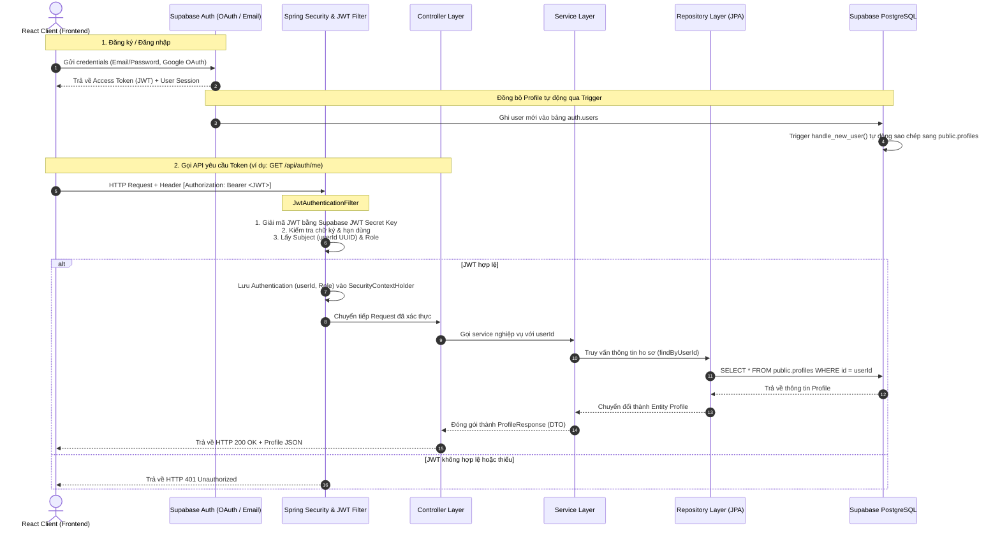

# Kiến Trúc Spring Boot & Tích Hợp Supabase Authentication

Tài liệu này giải thích chi tiết về cấu trúc hệ thống, luồng dữ liệu (Data Flow), mối quan hệ giữa các thành phần trong Backend Spring Boot, và cách tích hợp xác thực với **Supabase Authentication**.

---

## 1. Sơ Đồ Tổng Quan Kiến Trúc & Luồng Dữ Liệu

Hệ thống hoạt động theo mô hình **Stateless JWT-based Authentication** kết hợp với kiến trúc phân tầng (**Layered Architecture**) chuẩn mực của Spring Boot.

### Sơ đồ tương tác (Mermaid)



---

## 2. Giải Thích Các Tầng (Layers) Trong Spring Boot

Dự án tuân thủ kiến trúc phân lớp truyền thống để đảm bảo tính dễ bảo trì, dễ mở rộng và kiểm thử:

1. **Tầng Filter / Security (`config/`)**:
   - Chặn mọi request đi vào hệ thống.
   - Giải mã token và thiết lập trạng thái đăng nhập cho Spring Security.
   
2. **Tầng Controller (`controller/`)**:
   - Điểm tiếp nhận request HTTP cuối cùng (sau khi qua tầng Security).
   - Chỉ chịu trách nhiệm: Nhận tham số, gọi Service xử lý, và trả về dữ liệu định dạng JSON (kèm mã HTTP Status phù hợp).
   
3. **Tầng Service (`service/`)**:
   - Nơi chứa **Logic nghiệp vụ** (Business Logic).
   - Xử lý các phép toán, kiểm tra điều kiện logic, ghi log, quản lý Transaction (`@Transactional`).
   - Nhận Entity từ Repository và ánh xạ (mapping) sang DTO (Data Transfer Object) để gửi lại cho Controller.

4. **Tầng Repository (`repository/`)**:
   - Tầng giao tiếp trực tiếp với cơ sở dữ liệu sử dụng **Spring Data JPA**.
   - Định nghĩa các interface kế thừa `JpaRepository` giúp thao tác CRUD mà không cần tự viết mã SQL thủ công.

5. **Tầng Model/Entity (`model/`)**:
   - Ánh xạ trực tiếp cấu trúc bảng trong PostgreSQL thành các class Java (sử dụng các annotation của JPA như `@Entity`, `@Table`, `@Column`).

6. **Tầng DTO (Data Transfer Object) (`dto/`)**:
   - Định nghĩa cấu trúc dữ liệu gửi và nhận giữa Client và Server. Giúp giấu đi các trường nhạy cảm trong Database (như mật khẩu, dữ liệu hệ thống) và tối ưu hóa băng thông.

---

## 3. Tích Hợp Supabase Authentication: Spring Boot Sử Dụng Thế Nào?

Một câu hỏi quan trọng: **Chúng ta có dùng Authentication của Supabase không?**
> **Trả lời**: **CÓ**. Nhưng cách tích hợp cực kỳ tối ưu và bảo mật (được gọi là mô hình **Resource Server**).

### Cơ chế hoạt động:
* **Frontend nắm quyền tương tác trực tiếp với Supabase Auth**: Khi người dùng nhấn Đăng ký hoặc Đăng nhập trên React, React sử dụng SDK `@supabase/supabase-js` gửi yêu cầu trực tiếp đến API của Supabase. Supabase sẽ xác thực và trả về một **JWT Token** (JSON Web Token) cho React.
* **Spring Boot đóng vai trò xác thực Token (Resource Server)**:
  - Spring Boot **không cần** gọi API sang Supabase để xác minh user mỗi khi có request (điều này giúp tránh độ trễ mạng - Network Latency).
  - Thay vào đó, Spring Boot sử dụng thư viện `jjwt` giải mã JWT Token trực tiếp ở bộ nhớ Local.
  - Điều này khả thi là vì **Supabase JWT Secret** (được cấu hình trong file `application.yml`) và Supabase Auth Server cùng chia sẻ một khóa bí mật (Secret Key). Bất kỳ token nào được ký bởi Supabase đều có thể được Spring Boot giải mã và xác minh tính toàn vẹn bằng khóa bí mật này.
  
### Chi tiết các file xử lý Xác thực:

* **[JwtAuthenticationFilter.java](file:///d:/Smart-Hotel-Booking/backend/src/main/java/com/hotel/booking/config/JwtAuthenticationFilter.java)**:
  - Kế thừa `OncePerRequestFilter`, chạy trên mỗi request gửi lên.
  - Lấy chuỗi token từ header `Authorization: Bearer <JWT>`.
  - Dùng khóa bí mật `supabase.jwt.secret` để mở khóa JWT.
  - Extract trường `sub` (chứa UUID duy nhất của tài khoản trên Supabase Auth).
  - Lấy trường `role` (phân quyền).
  - Khởi tạo đối tượng `UsernamePasswordAuthenticationToken` và đưa vào `SecurityContextHolder` của Spring Security để đánh dấu request này đã được xác thực thành công.

* **[SecurityConfig.java](file:///d:/Smart-Hotel-Booking/backend/src/main/java/com/hotel/booking/config/SecurityConfig.java)**:
  - Định nghĩa các endpoint nào công khai (`permitAll()`) như: Tìm kiếm phòng `/api/public/**`, Chatbot `/api/ai/chat`.
  - Endpoint nào cần đăng nhập (`authenticated()`) như: Lấy thông tin cá nhân `/api/auth/**`, đặt phòng, gửi yêu cầu dịch vụ.
  - Cấu hình ứng dụng chạy ở chế độ **Stateless** (`SessionCreationPolicy.STATELESS`) - nghĩa là không lưu Session trên Server, tất cả thông tin đăng nhập đều dựa trên Token đi kèm request.

---

## 4. Cơ Chế Tự Động Đồng Bộ Profile Từ Supabase Sang PostgreSQL

Khi một tài khoản được tạo trên Supabase Auth, dữ liệu sẽ nằm ở schema nội bộ của Supabase là `auth.users`. Spring Boot JPA không thể (và không nên) truy cập trực tiếp vào schema hệ thống này.

Để giải quyết, chúng ta đã thiết lập một **Database Trigger** trực tiếp trong PostgreSQL (`init.sql`):

```sql
-- Hàm tự động chạy khi có user mới đăng ký
CREATE OR REPLACE FUNCTION public.handle_new_user()
RETURNS TRIGGER AS $$
BEGIN
  INSERT INTO public.profiles (id, full_name, avatar_url, role, loyalty_tier, loyalty_points)
  VALUES (
    NEW.id, -- UUID sinh ra từ auth.users
    COALESCE(NEW.raw_user_meta_data->>'full_name', 'Khách hàng'), -- Lấy từ metadata đăng ký
    NEW.raw_user_meta_data->>'avatar_url',
    'USER',
    'MEMBER',
    0
  );
  RETURN NEW;
END;
$$ LANGUAGE plpgsql SECURITY DEFINER;

-- Gắn trigger vào bảng auth.users
CREATE OR REPLACE TRIGGER on_auth_user_created
  AFTER INSERT ON auth.users
  FOR EACH ROW EXECUTE FUNCTION public.handle_new_user();
```

### Lợi ích của cơ chế này:
1. **Tính nhất quán**: Spring Boot chỉ cần quản lý bảng `public.profiles`. Khóa ngoại `id` của bảng này tham chiếu trực tiếp tới UUID của tài khoản.
2. **Không tốn tài nguyên**: Tách biệt hoàn toàn việc lưu trữ tài khoản (Supabase Auth quản lý) và dữ liệu nghiệp vụ khách sạn (Spring Boot quản lý).
3. **Bảo mật**: Spring Boot chỉ truy vấn thông tin Profile cần thiết qua `ProfileRepository` mà không cần biết mật khẩu của người dùng là gì (Supabase Auth đã mã hóa và bảo mật mật khẩu ở tầng dịch vụ của họ).

---

## 5. Phân Tích Đường Đi Chi Tiết của API `GET /api/auth/me`

Hãy xem cách các thành phần code bạn đã viết tương tác với nhau khi người dùng gọi API lấy thông tin cá nhân:

1. **Client gọi API**: Gửi request `GET http://localhost:8080/api/auth/me` kèm header `Authorization: Bearer <JWT>`.
2. **`JwtAuthenticationFilter` hoạt động**:
   - Bóc tách JWT. Giải mã lấy được `sub = "9b1deb4d-3b7d-4bad-9bdd-2b0d7b3dcb6d"` (Ví dụ một UUID).
   - Đặt đối tượng Authentication vào SecurityContext.
3. **`SecurityConfig` kiểm duyệt**: Nhận thấy API `/api/auth/me` yêu cầu xác thực, kiểm tra trong SecurityContext thấy đã có Authentication hợp lệ -> Cho phép đi tiếp.
4. **`AuthController` tiếp nhận request**:
   - Method `getCurrentUser(Authentication authentication)` được gọi.
   - Lấy userId bằng lệnh `authentication.getName()` (kết quả trả về UUID chuỗi).
   - Gọi xuống Service: `profileService.getProfileByUserId(userId)`.
5. **`ProfileService` xử lý logic**:
   - Nhận UUID chuỗi, chuyển đổi thành kiểu `UUID` trong Java.
   - Gọi xuống Repository: `profileRepository.findById(uuid)`.
   - Nếu không tìm thấy profile, ném ra ngoại lệ `ResourceNotFoundException`.
   - Nếu tìm thấy, ánh xạ các trường dữ liệu từ Entity `Profile` sang DTO `ProfileResponse`.
6. **`ProfileRepository` thực hiện truy vấn**:
   - Spring JPA tự động sinh câu lệnh SQL `SELECT ... FROM profiles WHERE id = ?` và thực thi trên Database PostgreSQL của Supabase.
7. **Trả về kết quả**: Dữ liệu đi ngược lại lên Service -> Controller -> Trả về Client dưới dạng JSON sạch đẹp:
   ```json
   {
     "id": "9b1deb4d-3b7d-4bad-9bdd-2b0d7b3dcb6d",
     "fullName": "Nguyen Van A",
     "phoneNumber": "0987654321",
     "avatarUrl": "https://example.com/avatar.jpg",
     "role": "USER",
     "loyaltyTier": "GOLD",
     "loyaltyPoints": 1500
   }
   ```
8. **Xử lý lỗi toàn cục (`exception/`)**:
   - Nếu xảy ra lỗi (ví dụ không tìm thấy user), `GlobalExceptionHandler` sẽ bắt lỗi `ResourceNotFoundException` và trả về JSON chuẩn hóa gồm mã lỗi và thông điệp thay vì trả về cả một StackTrace dài ngoằng của Java.
