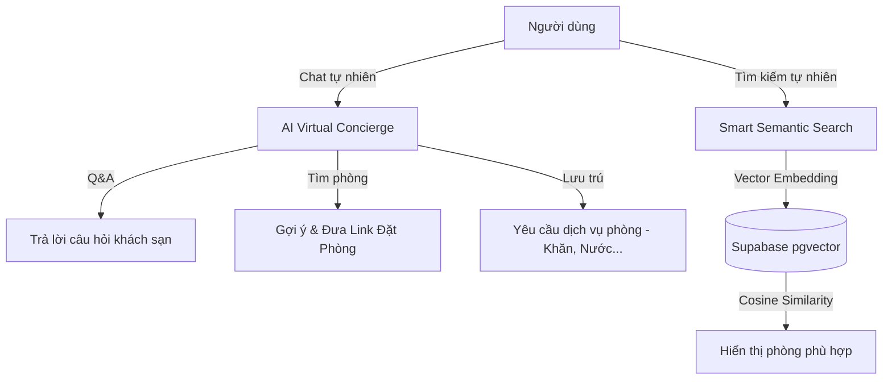

# ĐẶC TẢ DỰ ÁN TINH GỌN: BOOKING KHÁCH SẠN TÍCH HỢP AI
## CÔNG NGHỆ: JAVA SPRING BOOT + SUPABASE + REACT

Tài liệu này tập trung đặc tả hệ thống đặt phòng khách sạn thông minh với **2 tính năng AI trọng tâm** (AI Virtual Concierge & Smart Semantic Search), đồng thời áp dụng các **kiến thức nền tảng Spring Boot cốt lõi** mà các nhà tuyển dụng tìm kiếm.

---

## 1. PHẠM VI TÍNH NĂNG AI TRỌNG TÂM

Dự án này sẽ lược bỏ các tính năng AI khác và tập trung tối đa vào việc xây dựng xuất sắc 2 tính năng sau:



### 1.1. AI Virtual Concierge (Trợ lý ảo đặt phòng & dịch vụ phòng)
Hệ thống chatbot thông minh tích hợp trực tiếp vào giao diện React, gọi API Spring Boot xử lý logic.
*   **Hỏi đáp thông thường (Q&A)**:
    *   Trả lời về quy định (Ví dụ: chính sách mang thú cưng, giờ nhận/trả phòng, giờ mở cửa hồ bơi).
*   **Hỗ trợ Tìm & Đặt phòng**:
    *   Khách chat: *"Tôi muốn tìm phòng Suite có bồn tắm cho 2 người vào cuối tuần này"*.
    *   AI nhận diện các tham số: `Loại phòng: Suite`, `Tiện ích: Bồn tắm`, `Số người: 2`, `Thời gian: Cuối tuần này (tự động tính ra ngày cụ thể)`.
    *   AI trả về danh sách phòng trống kèm link đặt trực tiếp trên giao diện React.
*   **Yêu cầu dịch vụ phòng khi đang lưu trú (Housekeeping Integration)**:
    *   Khách chat: *"Gửi thêm cho tôi 2 khăn tắm lên phòng 402"*.
    *   AI nhận diện **Ý định (Intent)**: `Yêu cầu dịch vụ`, **Tham số (Parameters)**: `Khăn tắm`, `Số lượng: 2`, `Số phòng: 402`.
    *   Hệ thống tự động tạo một bản ghi yêu cầu dịch vụ (Service Request) vào Database và kích hoạt sự kiện Realtime để thông báo đến app quản lý của nhân viên buồng phòng.

### 1.2. Smart Semantic Search (Tìm kiếm ngữ nghĩa thông minh)
Cho phép khách hàng tìm phòng bằng mô tả mong muốn thay vì chỉ click chọn bộ lọc.
*   **Cơ chế hoạt động**:
    *   Khách nhập: *"Tôi muốn tìm phòng yên tĩnh để làm việc, có ban công hướng biển và gần hồ bơi"*.
    *   Spring Boot tiếp nhận, gọi API tạo Vector Embedding cho câu hỏi.
    *   Sử dụng truy vấn SQL Native (độ tương đồng Cosine) trên Supabase PostgreSQL đã cài `pgvector` để tìm các loại phòng (`room_types`) có mô tả khớp nhất.
    *   Trả về danh sách phòng được xếp hạng từ cao xuống thấp theo độ tương thích.

---

## 2. CÁC KIẾN THỨC SPRING BOOT CỐT LÕI ĐƯỢC ÁP DỤNG

Để dự án trở thành một điểm nhấn mạnh mẽ trong CV xin việc, chúng ta sẽ áp dụng các chuẩn thiết kế Spring Boot chuyên nghiệp sau:

### 2.1. Cấu trúc Layered Architecture chuẩn Clean Code
Phân tách rõ ràng trách nhiệm giữa các Layer:
*   `Controller`: Chỉ đảm nhận việc nhận request, validate dữ liệu đầu vào (`@Valid`) và trả về response.
*   `Service`: Nơi xử lý logic nghiệp vụ chính, áp dụng `@Transactional` để đảm bảo tính nhất quán dữ liệu.
*   `Repository`: Tương tác với cơ sở dữ liệu qua Spring Data JPA. Sử dụng Custom Query để tối ưu hiệu năng.
*   `DTO (Data Transfer Object)`: Tách biệt hoàn toàn thực thể Database (`Entity`) khỏi dữ liệu trả về cho Client. Sử dụng MapStruct hoặc ModelMapper.

### 2.2. Xử lý ngoại lệ tập trung (Global Exception Handling)
*   Sử dụng `@RestControllerAdvice` kết hợp `@ExceptionHandler` để bắt tất cả các ngoại lệ hệ thống và trả về định dạng JSON chuẩn.
*   Định dạng lỗi phản hồi đồng nhất:
    ```json
    {
      "timestamp": "2026-06-20T22:22:40",
      "status": 400,
      "error": "Bad Request",
      "message": "Ngày nhận phòng phải trước ngày trả phòng.",
      "path": "/api/bookings"
    }
    ```

### 2.3. Custom Validation (Kiểm thực dữ liệu tùy chỉnh)
*   Tạo annotation riêng (Ví dụ: `@ValidDateRange`) để kiểm tra logic phức tạp như: `checkInDate` phải trước `checkOutDate` và phải là ngày trong tương lai.

### 2.4. Xác thực phi trạng thái với Spring Security & Supabase JWT
*   Cấu hình Spring Security ở chế độ **Stateless** (SessionCreationPolicy.STATELESS).
*   Tạo `JwtAuthenticationFilter` để giải mã và xác thực JWT token do Supabase cấp (sử dụng thuật toán mã hóa khóa công khai hoặc khóa bí mật HS256 tương ứng với cài đặt của Supabase).
*   Trích xuất thông tin người dùng (`UserPrincipal`) và phân quyền truy cập thông qua các Custom Claims.

### 2.5. Xử lý bất đồng bộ (Asynchronous Processing)
*   Sử dụng `@Async` để xử lý các tác vụ tốn thời gian như gửi email xác nhận đặt phòng, hoặc gửi log phân tích AI lên hệ thống giám sát nhằm tăng tốc thời gian phản hồi API cho người dùng.

### 2.6. Logging chuyên nghiệp với SLF4J (Lombok `@Slf4j`)
*   Ghi log rõ ràng cho các hoạt động quan trọng (đặt phòng, lỗi hệ thống, thời gian xử lý AI).
*   Sử dụng Mapped Diagnostic Context (MDC) để theo dõi luồng request của một người dùng cụ thể.

---

## 3. THIẾT KẾ CƠ SỞ DỮ LIỆU ĐỂ HỖ TRỢ AI (SUPABASE POSTGRESQL)

```sql
-- Kích hoạt extension pgvector phục vụ tìm kiếm ngữ nghĩa
CREATE EXTENSION IF NOT EXISTS vector;

-- Bảng lưu loại phòng kèm cột vector embedding
CREATE TABLE room_types (
    id UUID PRIMARY KEY DEFAULT gen_random_uuid(),
    name VARCHAR(100) NOT NULL,
    base_price DECIMAL(10,2) NOT NULL,
    capacity INT NOT NULL,
    description TEXT,
    -- Vector embedding 1536 chiều (chuẩn OpenAI text-embedding-ada-002)
    -- Hoặc 768 chiều tùy thuộc vào mô hình Embedding bạn sử dụng
    description_vector vector(1536) 
);

-- Bảng yêu cầu dịch vụ phòng (phục vụ tính năng Housekeeping từ Chatbot)
CREATE TABLE room_service_requests (
    id UUID PRIMARY KEY DEFAULT gen_random_uuid(),
    room_number VARCHAR(10) NOT NULL,
    item_name VARCHAR(100) NOT NULL,
    quantity INT NOT NULL DEFAULT 1,
    status VARCHAR(20) NOT NULL DEFAULT 'PENDING', -- PENDING, IN_PROGRESS, COMPLETED
    created_at TIMESTAMP WITH TIME ZONE DEFAULT NOW()
);
```

---

## 4. KẾ HOẠCH PHÁT TRIỂN & XÂY DỰNG SKILLS

Để hỗ trợ bạn học tập và triển khai hiệu quả, tôi sẽ tạo **3 bộ tài liệu thực hành (Skills)** lưu trữ ngay trong dự án của bạn để bạn làm theo từng bước:

1.  **[Skill 1: Thiết lập Spring Boot Core & Security](file:///d:/Smart-Hotel-Booking/docs/skills/spring-boot-core-best-practices.md)**: Hướng dẫn viết Controller, Service, DTO, Security kết nối Supabase JWT, Global Exception Handling và Custom Validator.
2.  **[Skill 2: Tích hợp Supabase pgvector & Tìm kiếm Ngữ nghĩa](file:///d:/Smart-Hotel-Booking/docs/skills/spring-ai-supabase-vector.md)**: Hướng dẫn cấu hình Spring AI, lưu trữ Vector Embedding và thực hiện tìm kiếm tương đồng trên JPA.
3.  **[Skill 3: Phát triển AI Chatbot & Intent Recognition](file:///d:/Smart-Hotel-Booking/docs/skills/ai-chat-intent-recognition.md)**: Hướng dẫn xử lý hội thoại, nhận diện ý định đặt phòng/gọi dịch vụ và cập nhật Realtime với Supabase.
