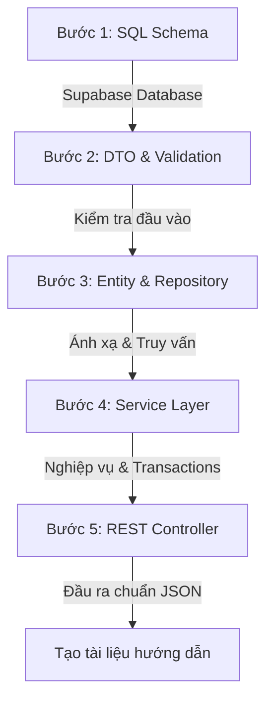

# SKILL: BỘ QUY CHUẨN VÀ PHƯƠNG PHÁP PHÁT TRIỂN TÍNH NĂNG MỚI (SPRING BOOT + SUPABASE)

Tài liệu này đóng vai trò là một **Skill cấu trúc** (Instruction set) hướng dẫn AI Agent cách tự động hóa quy trình xây dựng, tích hợp và tài liệu hóa bất kỳ tính năng mới nào cho dự án `Smart-Hotel-Booking`. 

Mỗi khi người dùng yêu cầu: *"Hãy thêm tính năng X"*, Agent **BẮT BUỘC** phải đọc tài liệu này và thực hiện tuần tự theo quy trình dưới đây.

---

## 1. QUY TRÌNH 5 BƯỚC TRIỂN KHAI TÍNH NĂNG MỚI

Khi thêm bất kỳ tính năng nào, Agent phải tuân thủ nghiêm ngặt 5 bước sau:



### Bước 1: Thiết kế & Cập nhật Cơ sở dữ liệu (Supabase / Postgres)
*   **Hành động**: Xác định bảng mới hoặc các cột cần thêm.
*   **Yêu cầu**: Cung cấp đoạn mã SQL hoàn chỉnh có chứa các ràng buộc khóa ngoại (Foreign Key), giá trị mặc định, kiểm tra tính toàn vẹn (Constraints) và chỉ mục (Indexes) để tăng hiệu năng tìm kiếm.

### Bước 2: Thiết kế DTO (Data Transfer Object) & Validation
*   **Hành động**: Tạo các lớp DTO để trao đổi dữ liệu nhằm bảo mật cấu trúc bảng database gốc.
*   **Yêu cầu**:
    *   Tách biệt rõ ràng: `XRequestDTO` (nhận dữ liệu đầu vào) và `XResponseDTO` (trả dữ liệu về cho client).
    *   Sử dụng `@NotNull`, `@NotBlank`, `@Size`, `@Min`, `@Max` từ thư viện `jakarta.validation.constraints` để validate dữ liệu đầu vào trực tiếp tại DTO.

### Bước 3: Ánh xạ Entity & Khởi tạo Repository
*   **Hành động**: Tạo lớp Entity tương ứng với Database và thiết lập Repository.
*   **Yêu cầu**:
    *   Định nghĩa rõ các mối quan hệ `@ManyToOne`, `@OneToMany` (ưu tiên sử dụng `FetchType.LAZY` để tránh lỗi N+1 queries).
    *   Repository kế thừa `JpaRepository`. Nếu viết Custom Query, sử dụng JPQL hoặc Native SQL và giải thích rõ logic.

### Bước 4: Viết Service Layer (Xử lý Logic & Transaction)
*   **Hành động**: Viết Service xử lý logic nghiệp vụ chính của tính năng.
*   **Yêu cầu**:
    *   Sử dụng `@Service` và `@RequiredArgsConstructor` từ Lombok để tự động tiêm dependencies (Dependency Injection qua Constructor).
    *   Đánh dấu `@Transactional` cho các hàm thực hiện thay đổi dữ liệu (insert, update, delete) để đảm bảo tính nhất quán dữ liệu.
    *   Sử dụng Logger (`@Slf4j`) ghi lại các bước chạy quan trọng và các tham số đầu vào.
    *   Ném ra các ngoại lệ nghiệp vụ cụ thể (ví dụ: `ResourceNotFoundException`, `BadRequestException`) để Bộ bắt lỗi tập trung (`GlobalExceptionHandler`) xử lý.

### Bước 5: Viết REST Controller
*   **Hành động**: Công khai API Endpoint cho Frontend sử dụng.
*   **Yêu cầu**:
    *   Đặt URI chuẩn RESTful (ví dụ: `GET /api/bookings`, `POST /api/bookings`).
    *   Sử dụng `@Valid` trước `@RequestBody` để kích hoạt validate DTO.
    *   Sử dụng đúng HTTP Status Codes (`200 OK`, `201 Created`, `400 Bad Request`, `404 Not Found`).

---

## 2. CHUẨN MỰC TÀI LIỆU HÓA CODE (CLEAN CODE & JAVADOC)

Mọi tệp tin code Java Spring Boot do Agent viết ra đều phải tuân thủ cấu trúc tài liệu sau:

1.  **Mô tả Class**: Đặt JavaDoc ở đầu Class giải thích vai trò của thành phần này.
2.  **Mô tả Method**: Đặt JavaDoc giải thích các tham số đầu vào (`@param`), kết quả trả về (`@return`) và các trường hợp lỗi ném ra ngoại lệ (`@throws`).
3.  **Chú thích dòng code**: Giải thích các thuật toán hoặc nghiệp vụ phức tạp trực tiếp bên cạnh dòng code bằng tiếng Việt ngắn gọn.

---

## 3. KHUNG MẪU CODE TIÊU CHUẨN (TEMPLATE SKELETON)

Khi viết code cho tính năng mới, Agent hãy sao chép các mẫu cấu trúc dưới đây để triển khai:

### Mẫu 1: DTO Request (Nhận & Validate)
```java
package com.hotel.booking.dto;

import jakarta.validation.constraints.NotBlank;
import jakarta.validation.constraints.NotNull;
import lombok.Data;

/**
 * DTO nhận yêu cầu tạo [Tên Tính Năng].
 */
@Data
public class FeatureNameRequest {

    @NotBlank(message = "Tên thuộc tính không được để trống")
    private String name;

    @NotNull(message = "Giá trị không được để trống")
    private Integer amount;
}
```

### Mẫu 2: Entity & Repository
```java
package com.hotel.booking.model;

import jakarta.persistence.*;
import lombok.Getter;
import lombok.Setter;
import java.util.UUID;

/**
 * Thực thể ánh xạ bảng [Tên Bảng] trong Database.
 */
@Entity
@Table(name = "features")
@Getter
@Setter
public class FeatureEntity {

    @Id
    @GeneratedValue(strategy = GenerationType.AUTO)
    private UUID id;

    @Column(nullable = false)
    private String name;

    @Column(nullable = false)
    private Integer amount;
}
```

```java
package com.hotel.booking.repository;

import com.hotel.booking.model.FeatureEntity;
import org.springframework.data.jpa.repository.JpaRepository;
import org.springframework.stereotype.Repository;
import java.util.UUID;

/**
 * Lớp truy xuất dữ liệu cho FeatureEntity.
 */
@Repository
public interface FeatureRepository extends JpaRepository<FeatureEntity, UUID> {
    // Thêm các phương thức truy vấn tùy chỉnh tại đây nếu cần
}
```

### Mẫu 3: Service Layer (Nghiệp vụ, Transaction & Log)
```java
package com.hotel.booking.service;

import com.hotel.booking.dto.FeatureNameRequest;
import com.hotel.booking.model.FeatureEntity;
import com.hotel.booking.repository.FeatureRepository;
import com.hotel.booking.exception.ResourceNotFoundException;
import lombok.RequiredArgsConstructor;
import lombok.extern.slf4j.Slf4j;
import org.springframework.stereotype.Service;
import org.springframework.transaction.annotation.Transactional;
import java.util.UUID;

/**
 * Dịch vụ xử lý nghiệp vụ cho tính năng [Tên Tính Năng].
 */
@Service
@RequiredArgsConstructor
@Slf4j
public class FeatureService {

    private final FeatureRepository featureRepository;

    /**
     * Tạo mới một bản ghi đặc tính.
     * 
     * @param request Dữ liệu yêu cầu từ client
     * @return FeatureEntity thực thể đã lưu thành công
     */
    @Transactional
    public FeatureEntity createFeature(FeatureNameRequest request) {
        log.info("Bắt đầu xử lý nghiệp vụ tạo tính năng mới: Tên='{}', Giá trị={}", request.getName(), request.getAmount());

        FeatureEntity entity = new FeatureEntity();
        entity.setName(request.getName());
        entity.setAmount(request.getAmount());

        FeatureEntity savedEntity = featureRepository.save(entity);
        log.info("Đã lưu thành công tính năng với ID: {}", savedEntity.getId());
        
        return savedEntity;
    }

    /**
     * Lấy thông tin tính năng theo ID.
     * 
     * @param id Khóa chính của tính năng
     * @return FeatureEntity thực thể tìm thấy
     * @throws ResourceNotFoundException nếu không tìm thấy ID
     */
    @Transactional(readOnly = true)
    public FeatureEntity getFeatureById(UUID id) {
        log.info("Tìm kiếm tính năng với ID: {}", id);

        return featureRepository.findById(id)
                .orElseThrow(() -> {
                    log.error("Không tìm thấy tính năng với ID: {}", id);
                    return new ResourceNotFoundException("Không tìm thấy tính năng có ID: " + id);
                });
    }
}
```

### Mẫu 4: REST Controller (Endpoint)
```java
package com.hotel.booking.controller;

import com.hotel.booking.dto.FeatureNameRequest;
import com.hotel.booking.model.FeatureEntity;
import com.hotel.booking.service.FeatureService;
import jakarta.validation.Valid;
import lombok.RequiredArgsConstructor;
import org.springframework.http.HttpStatus;
import org.springframework.http.ResponseEntity;
import org.springframework.web.bind.annotation.*;
import java.util.UUID;

/**
 * API cung cấp các dịch vụ liên quan đến [Tên Tính Năng].
 */
@RestController
@RequestMapping("/api/features")
@RequiredArgsConstructor
public class FeatureController {

    private final FeatureService featureService;

    /**
     * Tạo mới tính năng.
     * HTTP Method: POST /api/features
     */
    @PostMapping
    public ResponseEntity<FeatureEntity> createFeature(@Valid @RequestBody FeatureNameRequest request) {
        FeatureEntity result = featureService.createFeature(request);
        return new ResponseEntity<>(result, HttpStatus.CREATED);
    }

    /**
     * Lấy chi tiết tính năng theo ID.
     * HTTP Method: GET /api/features/{id}
     */
    @GetMapping("/{id}")
    public ResponseEntity<FeatureEntity> getFeatureById(@PathVariable("id") UUID id) {
        FeatureEntity result = featureService.getFeatureById(id);
        return ResponseEntity.ok(result);
    }
}
```
